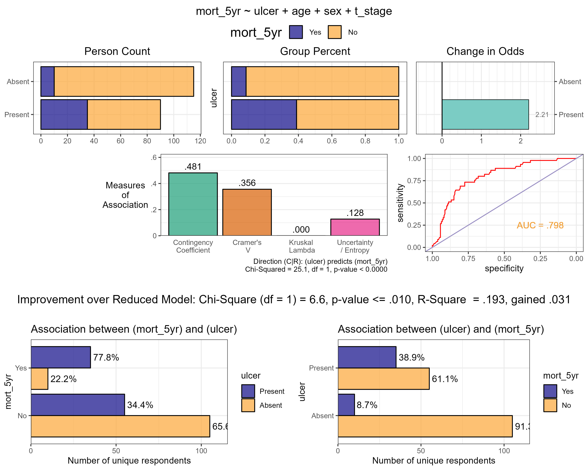

# Binary-Categorical Viewer

Custom functions to support model comparisons of multiple logistic regressions.

# Target Information Display

The following display of information is the key product of the functions. It structures model comparison and provides the indices to support formal statistical testing. 

  

# References and Useful materials

- [Visualizing Multivariate Categorical Data](http://www.sthda.com/english/articles/32-r-graphics-essentials/129-visualizing-multivariate-categorical-data/) - Some ideas about visualizing contingency tables - by STHDA    
- [The Contingency Coeficient](https://www.geo.fu-berlin.de/en/v/soga/Basics-of-statistics/Descriptive-Statistics/Measures-of-Relation-Between-Variables/Contingency-Coeficient/index.html) - by Free University of Berlin   
- [Measures of Association for Nominal Variables](https://rcompanion.org/handbook/H_10.html) - Review of measures of association between categorical variables with R code examples - by Salvatore S. Mangiafico   
- [Categorical Data Analysis](https://web.pdx.edu/~newsomj/cdaclass/) - PSY 525/625  course at Portland State University - by Jason T. Newsom   
- [A bias-correction for Cram´er’s V and Tschuprow’s T](http://stats.lse.ac.uk/bergsma/pdf/cramerV3.pdf) - a paper by Wicher Bergsma
- [Categorical Data Analysis: Effect Size](https://learningstatisticswithr.com/book/chisquare.html#chisqeffectsize) - Chapter 12.4 in Learning statistics with R: A tutorial for psychology students and other beginners by Danielle Navarro  
- [Correlation between categorical variables](https://rpubs.com/hoanganhngo610/558925)- basic concepts and effect measures - post by Hoang Anh NGO 
- [Pearson’s chi-squared and Fisher’s exact tests](https://argoshare.is.ed.ac.uk/healthyr_book/pearsons-chi-squared-and-fishers-exact-tests.html) - Section 8.11 in R for Health Data Science by Ewen Harrison and Riinu Pius
- [Logistic Regression](https://argoshare.is.ed.ac.uk/healthyr_book/chap09-h1.html) - Chapter 9 in R for Health Data Science by Ewen Harrison and Riinu Pius
- [Association Analysis](https://bookdown.org/jhvdz1/dataanalytics/association-analysis.html) - Chapter 6 in Data Analytics book by Hans van der Zwan
- [Categorical Data Analysis](https://mybiostats.files.wordpress.com/2015/03/3rd-ed-alan_agresti_categorical_data_analysis.pdf) - book by Alan Agresti (3rd Ed)
- [Alan Agresti](http://users.stat.ufl.edu/~aa/) - homepage of Alan Agresti
